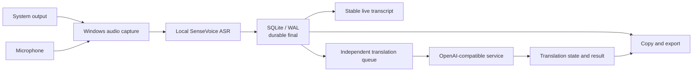

<h1 align="center">MeetingRelay</h1>

<p align="center">
  <strong>English</strong> · <a href="README.zh-CN.md">简体中文</a>
</p>

<p align="center">
  Local-first meeting transcription for Windows, powered by on-device SenseVoice ASR, durable SQLite storage, and optional OpenAI-compatible translation.
</p>

<p align="center">
  <a href="https://github.com/AsaZhou923/MeetingRelay/releases/latest"></a>
  <a href="https://github.com/AsaZhou923/MeetingRelay/actions/workflows/mvp.yml"></a>
  
  
  
</p>

<p align="center">
  <a href="#features">Features</a> ·
  <a href="#quick-start">Quick Start</a> ·
  <a href="#openai-compatible-translation">Translation</a> ·
  <a href="#development-and-validation">Development</a> ·
  <a href="#current-limitations">Limitations</a>
</p>

MeetingRelay captures system playback and microphone input, performs real-time speech recognition locally, and marks final transcript segments as saved only after a successful SQLite commit. When bilingual notes are needed, it can connect to Ollama, LM Studio, or a third-party OpenAI-compatible service. Translation failures never delete, overwrite, or delay the original transcript.

> [!IMPORTANT]
> The `MeetingRelay.exe` published in the current Release is unsigned and does not include the SenseVoice model or Sherpa native runtime. Follow the [Quick Start](#quick-start) instructions to create a complete same-machine package before first use.

## Features

- **Local real-time ASR** — uses a pinned Sherpa / SenseVoice int8 model; audio and speech recognition stay on the machine by default.
- **Dual-source capture** — select Windows system output and microphone devices.
- **Chinese, Japanese, and English** — select one recognition language before each meeting; the choice is locked while recording.
- **Stable live transcript** — final rows are reconciled by stable keys instead of rebuilding the entire list on every poll.
- **Persistence first** — the original transcript is committed to SQLite/WAL before it is shown as saved or submitted for translation.
- **Optional AI translation** — supports local and third-party OpenAI-compatible Chat Completions services.
- **Failure isolation** — translation, network, or model failures do not affect committed originals.
- **Meeting recovery** — recover committed finals after an abnormal exit and reopen the most recent meeting.
- **Copy and export** — copy the complete transcript or export JSON, Markdown, and TXT.
- **Windows personal release** — generate a same-machine directory containing the EXE, model, runtime, lock files, and a relative-path launcher.

## How it works



The ordering is always:

1. Local ASR produces a final segment.
2. The original text is committed to SQLite.
3. The UI marks the segment as saved.
4. If translation is enabled, the committed final is submitted asynchronously.
5. The translation is persisted independently as `completed`, `failed`, or `skipped`.

## Quick Start

### Requirements

- Windows 10 or Windows 11
- Node.js `24.13.0`
- pnpm `9.15.9`
- Rust `1.95.0` with `rustfmt` and `clippy`
- Visual Studio 2022 Build Tools with **Desktop development with C++**
- WebView2 Runtime
- Git for Windows

### Run from source

```powershell
git clone https://github.com/AsaZhou923/MeetingRelay.git
cd MeetingRelay

corepack enable
corepack prepare pnpm@9.15.9 --activate
pnpm install --frozen-lockfile

# First run: download and verify the pinned model and native runtime.
powershell -ExecutionPolicy Bypass -File tools/mvp/start.ps1 -AllowDownload
```

After the assets have been materialized, start without network downloads:

```powershell
powershell -ExecutionPolicy Bypass -File tools/mvp/start.ps1
```

Validate dependencies, assets, and the launch contract without opening the application:

```powershell
powershell -ExecutionPolicy Bypass -File tools/mvp/start.ps1 -DryRun
```

## Local ASR model

Use the repository script to download the model. It validates the lock file, SHA-256 digest, and extracted output:

```powershell
powershell -ExecutionPolicy Bypass -File tools/sherpa-native/materialize.ps1 `
  -AssetSet Model `
  -AllowDownload
```

Current model:

| Item | Value |
| --- | --- |
| Model | `sherpa-onnx-sense-voice-zh-en-ja-ko-yue-int8-2024-07-17` |
| Compressed archive | approximately 163 MB |
| `model.int8.onnx` | approximately 239 MB |
| Archive SHA-256 | `7d1efa2138a65b0b488df37f8b89e3d91a60676e416f515b952358d83dfd347e` |
| Default directory | `target/sherpa-native/extracted/sherpa-onnx-sense-voice-zh-en-ja-ko-yue-int8-2024-07-17/` |

The [upstream model archive](https://github.com/k2-fsa/sherpa-onnx/releases/download/asr-models/sherpa-onnx-sense-voice-zh-en-ja-ko-yue-int8-2024-07-17.tar.bz2) can also be downloaded manually, but the repository script is recommended because it verifies and materializes the complete asset layout.

> [!NOTE]
> Models and native runtime libraries are not included in the public Release asset. Their use and redistribution remain subject to the respective upstream licenses.

## OpenAI-compatible translation

MeetingRelay does not bundle a translation model. It can use a local Ollama / LM Studio instance or a cloud-hosted or self-hosted OpenAI-compatible Chat Completions service.

### Built-in presets

| Service | Base URL |
| --- | --- |
| Ollama | `http://127.0.0.1:11434/v1` |
| LM Studio | `http://127.0.0.1:1234/v1` |
| OpenAI | `https://api.openai.com/v1` |
| DeepSeek | `https://api.deepseek.com` |
| OpenRouter | `https://openrouter.ai/api/v1` |
| xAI | `https://api.x.ai/v1` |
| Alibaba Cloud Model Studio / DashScope | `https://dashscope.aliyuncs.com/compatible-mode/v1` |

Choose **Other compatible service** to enter a custom Base URL, model ID, and API token.

### Configuration

1. Enable OpenAI-compatible translation.
2. Select a provider preset or enter a custom Base URL.
3. Enter a model ID exposed by the selected service.
4. Select the translation language for the meeting: Chinese, Japanese, or English.
5. Run **Test connection**. The probe sends only a fixed synthetic sentence, never meeting content.
6. Confirm the recording and third-party data disclosure before starting the meeting.

If the translation language is the same as the recognition language, MeetingRelay does not contact the provider and persists the segment as `skipped`.

### Remote HTTP

HTTP is allowed directly for `localhost`, `127.0.0.1`, and `[::1]`. Non-loopback HTTP is rejected by default and is enabled only after the user explicitly selects **Allow insecure remote HTTP**.

> [!WARNING]
> Remote HTTP sends the API token and durable final transcript in plaintext. Traffic can be read or modified in transit. Acknowledging the risk records a user choice; it does not provide confidentiality or integrity. Prefer HTTPS.

API tokens remain in process memory and are never written to localStorage, SQLite, logs, or exports. The non-secret remote HTTP acknowledgement may be stored locally as a preference.

## Downloads and releases

Latest formal release: [MeetingRelay v0.0.1](https://github.com/AsaZhou923/MeetingRelay/releases/latest)

| File | Size | SHA-256 |
| --- | ---: | --- |
| [`MeetingRelay.exe`](https://github.com/AsaZhou923/MeetingRelay/releases/download/v0.0.1/MeetingRelay.exe) | 12,008,448 bytes | `2D8042763C3319E42A6BEB47953A4D1A5F6A1F3FE2EBA1A3FFE97ED0BF3C64BB` |

Build a complete same-machine package:

```powershell
pnpm mvp:release:personal
powershell -ExecutionPolicy Bypass `
  -File target/mvp/personal-release/MeetingRelay.same-machine.ps1
```

Output:

```text
target/mvp/personal-release/
├── MeetingRelay.exe
├── MeetingRelay.same-machine.ps1
├── model/
├── runtime/
└── locks/
```

This is a package-local personal Windows build, not an MSI or NSIS installer.

## Data and security

- Audio capture, local ASR, the original SQLite transcript, and exports stay on the machine by default.
- Durable final text is sent to the selected provider only when translation is enabled.
- Original text is committed before any network translation request; a provider failure cannot invalidate the local record.
- API tokens are not persisted and never appear in copied or exported transcript data.
- Base URLs reject embedded credentials, query strings, and fragments. Remote HTTP requires explicit acknowledgement.
- Data retention, training, billing, and regional policies for third-party services are controlled by the selected provider.
- Use the application only after meeting participants have consented to recording, transcription, and any required third-party data transfer.

Never commit `.env` files, API tokens, meeting databases, or real meeting exports.

## Development and validation

Frontend:

```powershell
pnpm --dir apps/desktop test
pnpm --dir apps/desktop typecheck
pnpm --dir apps/desktop build
```

Rust:

```powershell
cargo fmt --all -- --check
cargo clippy --workspace --all-targets --all-features -- -D warnings
cargo test --workspace --all-targets --all-features
```

Launch and release contracts:

```powershell
powershell -ExecutionPolicy Bypass -File tools/mvp/start.test.ps1
pnpm mvp:release:personal:test
```

CI is defined in [`.github/workflows/mvp.yml`](.github/workflows/mvp.yml). It runs on Windows Server 2022 and validates locked dependencies, the frontend, Rust formatting/Clippy/tests, pinned Sherpa assets, and the package-local Release build.

## Repository layout

```text
MeetingRelay/
├── apps/desktop/                         # Tauri 2 desktop application and frontend
├── crates/model-worker-sherpa-native/   # Product SenseVoice ASR backend
├── crates/model-worker-contract/        # Internal ASR interface types
├── tools/sherpa-native/                 # Pinned assets, validation, and runtime staging
├── tools/mvp/                           # Windows launch and release tooling
└── .github/workflows/mvp.yml            # Windows product CI
```

Earlier Phase 0, attestation, benchmark, candidate-engine, and experiment code is preserved on [`archive/full-repository-before-mvp-trim-2026-07-23`](https://github.com/AsaZhou923/MeetingRelay/tree/archive/full-repository-before-mvp-trim-2026-07-23).

## Current limitations

- Sherpa / SenseVoice is the only product ASR backend; Whisper, FunASR, and automatic fallback are not included.
- Mixed-language recognition is not supported. Each meeting uses one selected recognition language.
- OpenAI-compatible translation currently uses non-streaming requests per final segment. Token streaming, manual retry, context windows, proxies, custom headers/bodies, and complete provider provenance are not implemented.
- The 60-minute microphone path has passed a real-device endurance test. Audible system-loopback capture and device hot-plug behavior still require validation.
- A 10–20 minute real translated meeting, a second clean Windows machine, and a signed installer have not been validated.
- `MeetingRelay.exe` is unsigned, and public assets do not include the model or Sherpa runtime.
- Speaker diarization, meeting summaries, search, tags, and raw-audio playback are not implemented.

## Roadmap

- Validate ASR and translation quality with representative Chinese, Japanese, and English meetings.
- Add retry for individual failed segments and complete meetings.
- Validate audible system-output loopback and device hot-plug behavior.
- Evaluate streaming translation, single-source mode, and raw-audio storage based on real usage.
- Evaluate Windows Credential Manager, a signed installer, and a second clean-machine test.

## Contributing

Issues and pull requests are welcome. For larger product or architecture changes, open an issue first and describe the use case, data boundary, and acceptance criteria.

Before submitting a change, run at least:

```powershell
pnpm --dir apps/desktop test
pnpm --dir apps/desktop typecheck
cargo fmt --all -- --check
cargo clippy --workspace --all-targets --all-features -- -D warnings
cargo test --workspace --all-targets --all-features
```

Keep changes small and reviewable. Do not commit API tokens, real meeting content, model files, or local databases.

## License and distribution

This repository does not currently include a standalone `LICENSE` file. Until a code license is explicitly added, do not assume permission to copy, modify, or redistribute the repository's source code.

The SenseVoice model, Sherpa native runtime, and other third-party components remain subject to their respective upstream licenses. The formal GitHub Release provides only an unsigned EXE and does not bundle models or the native runtime.

## Acknowledgements

- [sherpa-onnx](https://github.com/k2-fsa/sherpa-onnx)
- [SenseVoice](https://github.com/FunAudioLLM/SenseVoice)
- [Tauri](https://tauri.app/)
- [Ollama](https://ollama.com/)
- [LM Studio](https://lmstudio.ai/)
