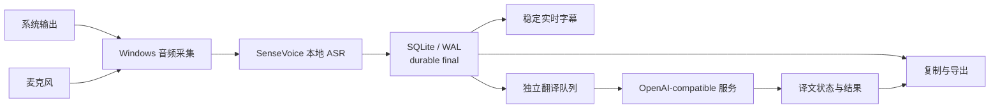

<h1 align="center">MeetingRelay</h1>

<p align="center">
  <a href="README.md">English</a> · <strong>简体中文</strong>
</p>

<p align="center">
  面向 Windows 的本地优先会议转写工具：本机 SenseVoice ASR、SQLite 持久化，以及可选的 OpenAI-compatible 翻译。
</p>

<p align="center">
  <a href="https://github.com/AsaZhou923/MeetingRelay/releases/latest"></a>
  <a href="https://github.com/AsaZhou923/MeetingRelay/actions/workflows/mvp.yml"></a>
  
  
  
</p>

<p align="center">
  <a href="#功能">功能</a> ·
  <a href="#快速开始">快速开始</a> ·
  <a href="#openai-compatible-翻译">翻译配置</a> ·
  <a href="#开发与验证">开发</a> ·
  <a href="#当前限制">限制</a>
</p>

MeetingRelay 同时采集电脑播放声音和麦克风输入，在本机完成实时语音识别，并且只在 SQLite 提交成功后把 final 文本标记为已保存。需要双语会议记录时，可以连接 Ollama、LM Studio 或第三方 OpenAI-compatible 服务；翻译失败不会删除、覆盖或延迟原文。

> [!IMPORTANT]
> 当前正式 Release 中的 `MeetingRelay.exe` 未签名，且不包含 SenseVoice 模型和 Sherpa 原生运行库。首次使用请按[快速开始](#快速开始)生成完整的同机运行目录。

## 功能

- **本地实时识别**：使用锁定的 Sherpa / SenseVoice int8 模型，音频与 ASR 默认留在本机。
- **双音源采集**：支持选择 Windows 系统输出和麦克风设备。
- **中、日、英三语**：每场会议开始前选择中文、日文或英文，会议进行中锁定。
- **稳定实时字幕**：final 行按稳定键增量更新，不会因轮询整表重建而反复闪烁。
- **持久化优先**：原文先提交 SQLite/WAL，再显示为已保存并进入翻译队列。
- **可选 AI 翻译**：支持本机和第三方 OpenAI-compatible Chat Completions 服务。
- **故障隔离**：翻译、网络或模型失败不影响已经提交的原文。
- **会议恢复**：异常退出后可以恢复已提交的 final，并重新打开最近会议。
- **复制与导出**：支持复制完整转写，以及导出 JSON、Markdown 和 TXT。
- **Windows personal release**：生成包含 EXE、模型、runtime、锁文件和相对路径启动器的同机目录。

## 工作方式



核心顺序始终是：

1. 本地 ASR 产生 final。
2. 原文成功提交 SQLite。
3. UI 显示“已保存”。
4. 若启用翻译，再异步请求所选服务。
5. 译文以 `completed`、`failed` 或 `skipped` 状态独立持久化。

## 快速开始

### 环境要求

- Windows 10 或 Windows 11
- Node.js `24.13.0`
- pnpm `9.15.9`
- Rust `1.95.0`，包含 `rustfmt` 和 `clippy`
- Visual Studio 2022 Build Tools（Desktop development with C++）
- WebView2 Runtime
- Git for Windows

### 从源码启动

```powershell
git clone https://github.com/AsaZhou923/MeetingRelay.git
cd MeetingRelay

corepack enable
corepack prepare pnpm@9.15.9 --activate
pnpm install --frozen-lockfile

# 首次运行：下载并校验锁定的模型与原生运行库
powershell -ExecutionPolicy Bypass -File tools/mvp/start.ps1 -AllowDownload
```

资产下载完成后，后续启动不再需要 `-AllowDownload`：

```powershell
powershell -ExecutionPolicy Bypass -File tools/mvp/start.ps1
```

只检查依赖、资产和启动契约，不打开应用：

```powershell
powershell -ExecutionPolicy Bypass -File tools/mvp/start.ps1 -DryRun
```

## 本地 ASR 模型

推荐使用仓库脚本下载模型。脚本会校验锁定文件、SHA-256 和解压结果：

```powershell
powershell -ExecutionPolicy Bypass -File tools/sherpa-native/materialize.ps1 `
  -AssetSet Model `
  -AllowDownload
```

当前模型：

| 项目 | 值 |
| --- | --- |
| 模型 | `sherpa-onnx-sense-voice-zh-en-ja-ko-yue-int8-2024-07-17` |
| 压缩包 | 约 163 MB |
| `model.int8.onnx` | 约 239 MB |
| 压缩包 SHA-256 | `7d1efa2138a65b0b488df37f8b89e3d91a60676e416f515b952358d83dfd347e` |
| 默认目录 | `target/sherpa-native/extracted/sherpa-onnx-sense-voice-zh-en-ja-ko-yue-int8-2024-07-17/` |

也可以[直接下载上游模型压缩包](https://github.com/k2-fsa/sherpa-onnx/releases/download/asr-models/sherpa-onnx-sense-voice-zh-en-ja-ko-yue-int8-2024-07-17.tar.bz2)，但仍建议使用脚本完成完整性校验和目录物化。

> [!NOTE]
> 模型与原生运行库不包含在公开 Release 附件中。使用和再分发时还需要遵守对应上游项目与模型资产的许可条款。

## OpenAI-compatible 翻译

MeetingRelay 不捆绑翻译模型。可以使用本机 Ollama / LM Studio，也可以连接云端或自建的 OpenAI-compatible Chat Completions 服务。

### 内置预设

| 服务 | Base URL |
| --- | --- |
| Ollama | `http://127.0.0.1:11434/v1` |
| LM Studio | `http://127.0.0.1:1234/v1` |
| OpenAI | `https://api.openai.com/v1` |
| DeepSeek | `https://api.deepseek.com` |
| OpenRouter | `https://openrouter.ai/api/v1` |
| xAI | `https://api.x.ai/v1` |
| 阿里云百炼 / DashScope | `https://dashscope.aliyuncs.com/compatible-mode/v1` |

也可以选择“其他兼容服务”，填写自定义 Base URL、模型 ID 和 API Token。

### 配置步骤

1. 启用 OpenAI-compatible 翻译。
2. 选择服务预设，或填写自定义 Base URL。
3. 填写服务实际提供的模型 ID。
4. 选择本场会议的译文语言：中文、日文或英文。
5. 点击“测试连接”；测试只发送固定合成短句，不发送会议内容。
6. 确认录音与第三方数据发送提示后开始会议。

当译文语言与识别语言相同时，MeetingRelay 不会请求模型，而是把该条记录为 `skipped`。

### 远程 HTTP

`localhost`、`127.0.0.1` 和 `[::1]` 可以直接使用 HTTP。非回环 HTTP 默认拒绝，只有在界面中显式勾选“不安全的远程 HTTP”后才放行。

> [!WARNING]
> 远程 HTTP 会以明文传输 API Token 和 durable final 原文，可能被读取或篡改。风险确认只表达用户选择，不能提供传输机密性或完整性；请优先配置 HTTPS。

API Token 只保存在当前应用进程内存，不写入 localStorage、SQLite、日志或导出。远程 HTTP 的风险确认属于非密钥偏好，可以保存在本机。

## 下载与发布

最新正式版本：[MeetingRelay v0.0.1](https://github.com/AsaZhou923/MeetingRelay/releases/latest)

| 文件 | 大小 | SHA-256 |
| --- | ---: | --- |
| [`MeetingRelay.exe`](https://github.com/AsaZhou923/MeetingRelay/releases/download/v0.0.1/MeetingRelay.exe) | 12,008,448 bytes | `2D8042763C3319E42A6BEB47953A4D1A5F6A1F3FE2EBA1A3FFE97ED0BF3C64BB` |

生成完整的同机运行目录：

```powershell
pnpm mvp:release:personal
powershell -ExecutionPolicy Bypass `
  -File target/mvp/personal-release/MeetingRelay.same-machine.ps1
```

输出目录：

```text
target/mvp/personal-release/
├── MeetingRelay.exe
├── MeetingRelay.same-machine.ps1
├── model/
├── runtime/
└── locks/
```

这是 package-local 的个人 Windows 构建，不是 MSI/NSIS 安装程序。

## 数据与安全

- 音频采集、本地 ASR、原文 SQLite 和导出默认只发生在本机。
- 只有启用翻译时，durable final 原文才会发送到所选服务。
- 原文提交发生在网络翻译之前；服务失败不会破坏本地记录。
- API Token 不持久化，也不会出现在复制或导出结果中。
- Base URL 拒绝 URL 凭据、查询参数和片段，远程 HTTP 需要显式确认。
- 第三方服务的数据保留、训练、费用和地域规则由对应供应商决定。
- 请在会议参与者同意录音、转写和必要的第三方数据发送后使用。

不要把 `.env`、API Token、会议数据库或真实会议导出提交到 Git。

## 开发与验证

前端：

```powershell
pnpm --dir apps/desktop test
pnpm --dir apps/desktop typecheck
pnpm --dir apps/desktop build
```

Rust：

```powershell
cargo fmt --all -- --check
cargo clippy --workspace --all-targets --all-features -- -D warnings
cargo test --workspace --all-targets --all-features
```

启动与发布契约：

```powershell
powershell -ExecutionPolicy Bypass -File tools/mvp/start.test.ps1
pnpm mvp:release:personal:test
```

CI 配置位于 [`.github/workflows/mvp.yml`](.github/workflows/mvp.yml)，在 Windows Server 2022 上执行依赖安装、前端验证、Rust 格式/Clippy/测试、锁定资产物化和 package-local Release 构建。

## 仓库结构

```text
MeetingRelay/
├── apps/desktop/                         # Tauri 2 桌面应用与前端
├── crates/model-worker-sherpa-native/   # SenseVoice 产品 ASR 后端
├── crates/model-worker-contract/        # ASR 内部接口类型
├── tools/sherpa-native/                 # 锁定资产、校验与 runtime staging
├── tools/mvp/                           # Windows 启动和发布脚本
└── .github/workflows/mvp.yml            # Windows 产品 CI
```

更早的 Phase 0、attestation、benchmark、候选引擎和实验代码保存在归档分支 [`archive/full-repository-before-mvp-trim-2026-07-23`](https://github.com/AsaZhou923/MeetingRelay/tree/archive/full-repository-before-mvp-trim-2026-07-23)。

## 当前限制

- 当前产品 ASR 固定为 Sherpa / SenseVoice，不提供 Whisper、FunASR 或自动 fallback。
- 当前不做中日英混合识别；每场会议只选择一种识别语言。
- OpenAI-compatible 翻译目前是 final 级非流式请求，尚无 token streaming、手动重试、上下文窗口、代理、自定义 Header/请求体或完整 provider provenance。
- 60 分钟麦克风链路已经通过真实设备验收；系统输出有声回环和设备热插拔仍需继续验证。
- 尚未完成 10–20 分钟真实翻译会议、第二台干净 Windows 电脑和签名安装包验收。
- `MeetingRelay.exe` 未签名，公开附件不包含模型或 Sherpa runtime。
- 尚未加入说话人区分、会议摘要、搜索、标签和原始音频回放。

## Roadmap

- 完成代表性中、日、英会议的 ASR 与翻译质量验收。
- 增加失败译文的单条与整场重试。
- 验证有声系统输出 loopback 和设备热插拔。
- 根据真实使用结果评估流式翻译、单一音源模式和原始音频保存。
- 评估 Windows Credential Manager、签名安装包和第二台干净电脑验收。

## 贡献

欢迎提交 Issue 和 Pull Request。较大的功能或架构改动建议先开 Issue 说明使用场景、数据边界和验收方式。

提交前请至少运行：

```powershell
pnpm --dir apps/desktop test
pnpm --dir apps/desktop typecheck
cargo fmt --all -- --check
cargo clippy --workspace --all-targets --all-features -- -D warnings
cargo test --workspace --all-targets --all-features
```

请保持改动小而可审查，不要提交 API Token、真实会议内容、模型文件或本机数据库。

## 许可与分发

本仓库当前尚未包含独立的 `LICENSE` 文件。在明确代码许可证之前，请不要假定拥有复制、修改或再分发本仓库代码的授权。

SenseVoice 模型、Sherpa 原生运行库及其他第三方组件分别受其上游许可证约束。正式 GitHub Release 只提供未签名 EXE，不捆绑模型和原生 runtime。

## 致谢

- [sherpa-onnx](https://github.com/k2-fsa/sherpa-onnx)
- [SenseVoice](https://github.com/FunAudioLLM/SenseVoice)
- [Tauri](https://tauri.app/)
- [Ollama](https://ollama.com/)
- [LM Studio](https://lmstudio.ai/)
